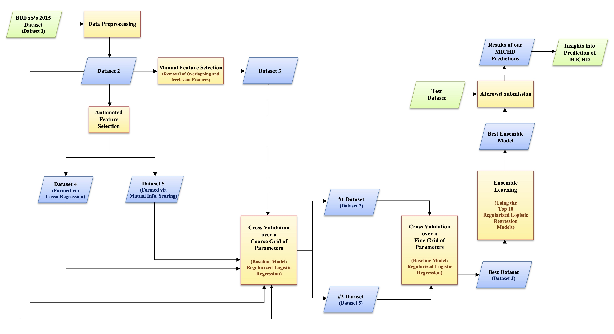

# Machine Learning System for the Prediction of MICHD

Git repository containing the implementation for the proposed solution described in 'Unveiling the Heart’s Secrets: Leveraging Machine Learning for the Prediction of MICHD', a classification-based model for predicting whether a given person would develop Myocardial Infarction or Coronary Heart Disease (MICHD) using health-related data.

## Recreating predictions
To recreate our best-performing model, please modify the ``DATA_PATH`` variable, which points to the dataset folder (containing ``x_train.csv,`` ``x_test.csv,`` and ``y_train.csv``). The ``run.py`` script will take approximately 4 minutes to perform data cleaning and preprocessing, and an additional 4 minutes to train our ensemble model.

## Flowchart

The flowchart of the pipeline followed by us for developing our ML based system can be seen above.

## Data Source
You can access the 2015 Behavioral Risk Factor Surveillance System (BRFSS) dataset [here](https://www.cdc.gov/brfss/annual_data/annual_2015.html).

## File Structure:
- Data Exploration and Preprocessing:
  - ``A1_Data_Processing.py``
  - ``A2_Data_Exploration.ipynb``

- Model Experimentation:
  - ``B1_Experiments_Notebook.ipynb``
  - ``B2_Model_Comparisons.ipynb``

- Model Inference:
  - ``C1_Inference.py``
  - ``C2_Inference_Performance_Datasets.ipynb``

- ``Results`` (outputs from Model Experimentation):
  - ``COARSE_GRID_TUNING.csv``
  - ``FINE_GRID_TUNING.csv``

- Helpers (helper functions to reduce the logic when implementing)
  - ``experiments.py``: contains model architecture (logistic regression, regularized logistic regression and ensemble regularized logistic regression).
  - ``helper_data_preprocessing.py``: contains data augmentation, standardization and undersampling.
  - ``helper_inference.py``: contains methods for predictions (after model training is complete).
  - ``helper_metrics.py``: contains methods for computing F-Score and accuracy.
  - ``helper_training.py``: contains grid-search and cross-validation logic.
  - ``helpers_submission.py``: contains methods for generating a prediction file for AI Crowd.
  early stopping, data augmentation

- ``run.py``:  code which reproduces best performing model.

